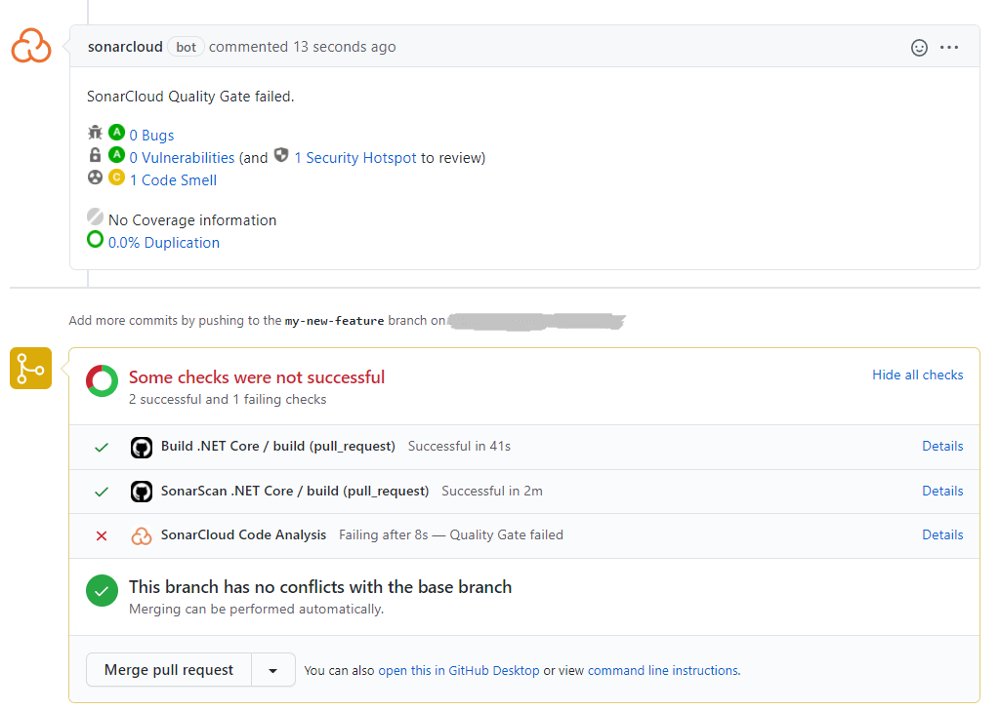
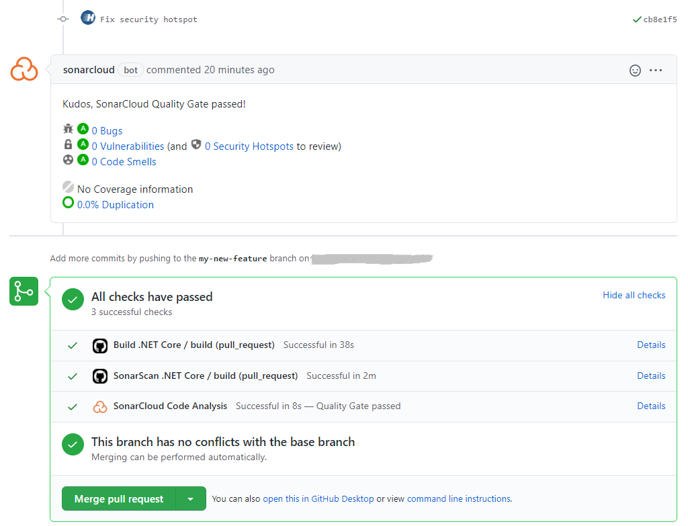

# SonarScanner for .NET


SonarScanner for .NET for use in Github Actions, with automatic pull request detection, analysis and decoration.

The current version supports .NET 5.
- For .NET Core 3.1, use version [1.0.2](https://github.com/marketplace/actions/sonarscan-dotnet?version=1.0.2)



# Usage examples

## Simple use with SonarCloud

``` yaml
    - name: SonarScanner for .NET 5 with pull request decoration support
      uses: highbyte/sonarscan-dotnet@2.0
      with:
        # The key of the SonarQube project
        sonarProjectKey: your_projectkey
        # The name of the SonarQube project
        sonarProjectName:  your_projectname
        # The name of the SonarQube organization in SonarCloud. For hosted SonarQube, skip this setting.
        sonarOrganization: your_organization

  env:
    SONAR_TOKEN: ${{ secrets.SONAR_TOKEN }}
    GITHUB_TOKEN: ${{ secrets.GITHUB_TOKEN }}
```

## Include code coverage with [Coverlet](https://github.com/coverlet-coverage/coverlet)
Also includes test results.

``` yaml
    - name: SonarScanner for .NET 5 with pull request decoration support
      uses: highbyte/sonarscan-dotnet@2.0
      with:
        # The key of the SonarQube project
        sonarProjectKey: your_projectkey
        # The name of the SonarQube project
        sonarProjectName:  your_projectname
        # The name of the SonarQube organization in SonarCloud. For hosted SonarQube, skip this setting.
        sonarOrganization: your_organization
        # Optional command arguments to dotnet test
        dotnetTestArguments: --logger trx --collect:"XPlat Code Coverage" -- DataCollectionRunSettings.DataCollectors.DataCollector.Configuration.Format=opencover
        # Optional extra command arguments the the SonarScanner 'begin' command
        sonarBeginArguments: /d:sonar.cs.opencover.reportsPaths="**/TestResults/**/coverage.opencover.xml" -d:sonar.cs.vstest.reportsPaths="**/TestResults/*.trx"
        
  env:
    SONAR_TOKEN: ${{ secrets.SONAR_TOKEN }}
    GITHUB_TOKEN: ${{ secrets.GITHUB_TOKEN }}
```

## Build subfolder src, and include code coverage
Also includes test results.

``` yaml
    - name: SonarScanner for .NET 5 with pull request decoration support
      uses: highbyte/sonarscan-dotnet@2.0
      with:
        # The key of the SonarQube project
        sonarProjectKey: your_projectkey
        # The name of the SonarQube project
        sonarProjectName:  your_projectname
        # The name of the SonarQube organization in SonarCloud. For hosted SonarQube, skip this setting.
        sonarOrganization: your_organization
        # Optional command arguments to dotnet build
        dotnetBuildArguments: ./src
        # Optional command arguments to dotnet test
        dotnetTestArguments: ./src --logger trx --collect:"XPlat Code Coverage" -- DataCollectionRunSettings.DataCollectors.DataCollector.Configuration.Format=opencover
        # Optional extra command arguments the the SonarScanner 'begin' command
        sonarBeginArguments: /d:sonar.cs.opencover.reportsPaths="**/TestResults/**/coverage.opencover.xml" -d:sonar.cs.vstest.reportsPaths="**/TestResults/*.trx"
        
  env:
    SONAR_TOKEN: ${{ secrets.SONAR_TOKEN }}
    GITHUB_TOKEN: ${{ secrets.GITHUB_TOKEN }}
```

## Skip tests

``` yaml
    - name: SonarScanner for .NET 5 with pull request decoration support
      uses: highbyte/sonarscan-dotnet@2.0
      with:
        # The key of the SonarQube project
        sonarProjectKey: your_projectkey
        # The name of the SonarQube project
        sonarProjectName:  your_projectname
        # The name of the SonarQube Organization
        sonarOrganization: your_organization
        # Optional. Set to 1 or true to not run 'dotnet test' command
        dotnetDisableTests: true
        
  env:
    SONAR_TOKEN: ${{ secrets.SONAR_TOKEN }}
    GITHUB_TOKEN: ${{ secrets.GITHUB_TOKEN }}
```

## Use with self-hosted SonarQube

``` yaml
    - name: SonarScanner for .NET 5 with pull request decoration support
      uses: highbyte/sonarscan-dotnet@2.0
      with:
        # The key of the SonarQube project
        sonarProjectKey: your_projectkey
        # The name of the SonarQube project
        sonarProjectName:  your_projectname
        # The SonarQube server URL. For SonarCloud, skip this setting.
        sonarHostname:  your_selfhosted_sonarqube_hostname
  env:
    SONAR_TOKEN: ${{ secrets.SONAR_TOKEN }}
    GITHUB_TOKEN: ${{ secrets.GITHUB_TOKEN }}
```

# Secrets
- `SONAR_TOKEN` – **Required** this is the token used to authenticate access to SonarCloud. You can generate a token on your [Security page in SonarCloud](https://sonarcloud.io/account/security/). You can set the `SONAR_TOKEN` environment variable in the "Secrets" settings page of your repository.
- *`GITHUB_TOKEN` – Provided by Github (see [Authenticating with the GITHUB_TOKEN](https://help.github.com/en/actions/automating-your-workflow-with-github-actions/authenticating-with-the-github_token)).*


# Description of all inputs

``` yaml
inputs:
  sonarProjectKey:
    description: "The key of the SonarQube project"
    required: true
  sonarProjectName:
    description: "The name of the SonarQube project"
    required: true
  sonarOrganization:
    description: "The name of the SonarQube organization in SonarCloud. For hosted SonarQube, skip this setting."
    required: false
  dotnetBuildArguments:
    description: "Optional command arguments to 'dotnet build'"
    required: false
  dotnetTestArguments:
    description: "Optional command arguments to 'dotnet test'"
    required: false
  dotnetDisableTests:
    description: "Optional. Set to 1 or true to not run 'dotnet test' command"
    required: false
  sonarBeginArguments:
    description: "Optional extra command arguments the the SonarScanner 'begin' command"
    required: false
  sonarHostname:
    description: "The SonarQube server URL. For SonarCloud, skip this setting."
    default: "https://sonarcloud.io"
    required: false
```

# Troubleshooting
## Build error "ERROR: Could not find a default branch to fall back on."
If this error occurs in the build log, you can try this:
* You may have to manually create the project in SonarQube/SonarCloud dashboard first. Make sure the Action input parameter sonarProjectKey (and sonarOrganization for SonarCloud) matches the ones in SonarQube/SonarCloud.
* Make sure you have correct SONAR_TOKEN set. See [Secrects](#secrets) above.

## SonarQube/SonarCloud dashboard warning "Shallow clone detected during the analysis..."
If the SonarQube/SonarCloud dashboard shows a warning message in the top right ("Last analysis had x warning"), and the message is

`"Shallow clone detected during the analysis. Some files will miss SCM information. This will affect features like auto-assignment of issues. Please configure your build to disable shallow clone."`

it can be fixed by modifying the Git checkout action fetch-depth parameter: 

``` yaml
- uses: actions/checkout@v2
      with:
        fetch-depth: '0'
```
